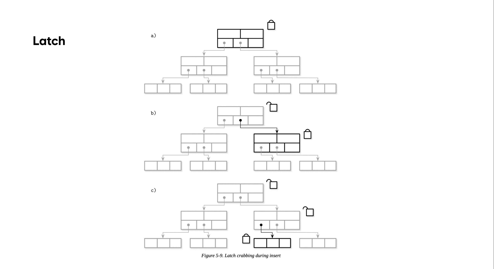
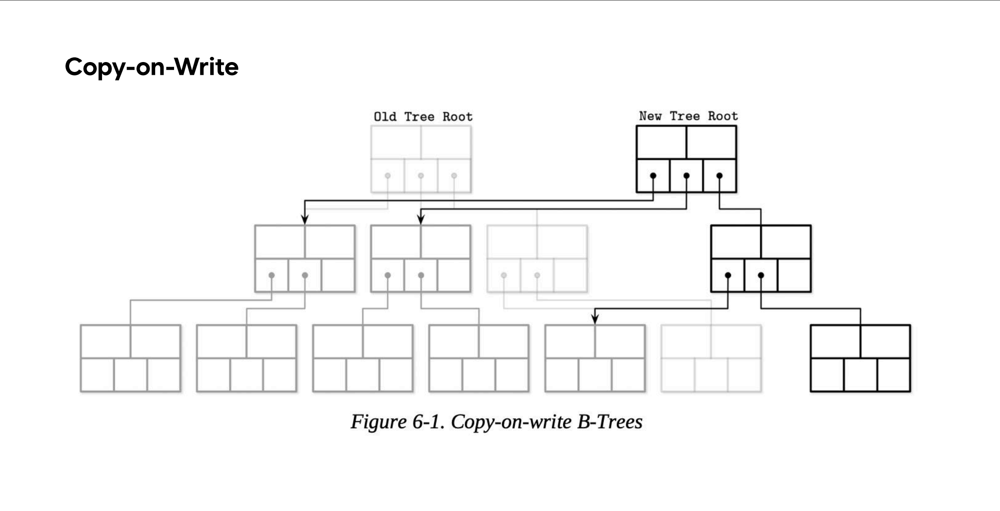
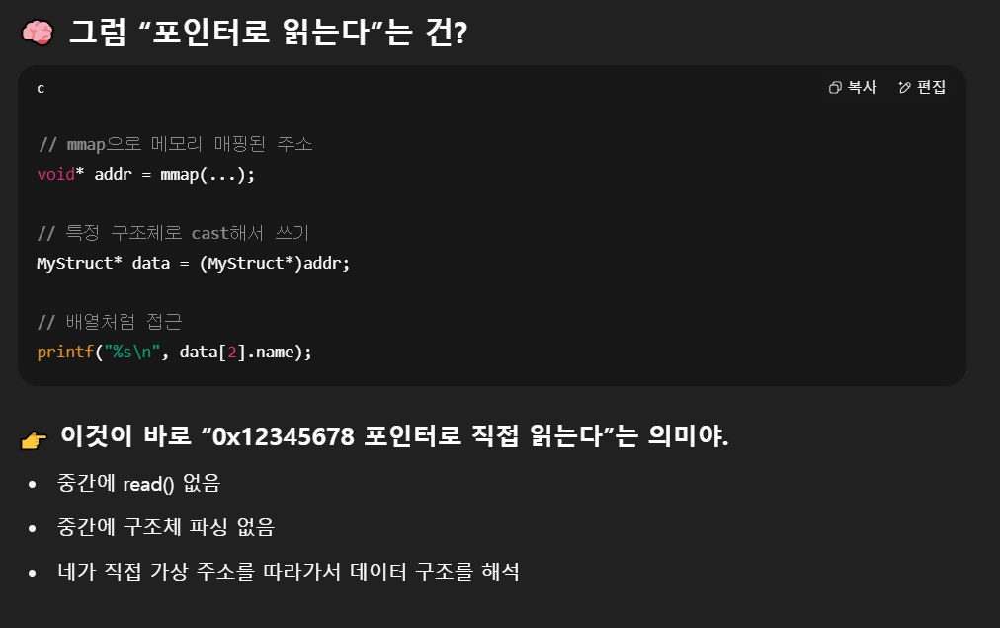
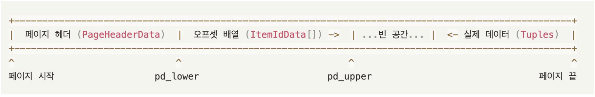
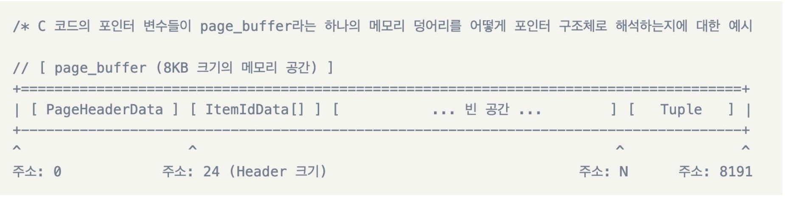

# 6-(1) B-Tree Variants
지금까지 배운 스토리지 엔진 구조 중 `B-tree`가 그나마 제일 기초적인 페이지 구성 방식이었다. `BST`나 `이진 트리`의 경우 `fanout`이 적기 때문에(**2**밖에 안됨-좌/우) 데이터 총 용량이 증가할 경우 데이터 탐색 시나 변경으로 초래되는 노드 분할/합병이 자주 일어나면 비효율적으로 비용이 증가한다. 그래서 트리의 높이를 낮춰 탐색 비용을 줄이기 위한 방식이 `fanout`을 늘려 한 노드에 키로 범위를 지정해 포인터를 여러개 가지도록 하는 트리 구조가 `B-Tree`였다.

하지만 여전히 특정상황에서는 아쉬운 점들이 있었고, 그것들을 해결하기 위해 변형시킨 버전들이 존재하는데 이것들을 **변형 B-tree**라고 한다. 이번에는 총 5가지의 변형 중 **3**가지를 살펴본다.
> - **Copy-on-write B-Tree**</br>
> - **Lazy B-Tree**</br>
> - **FD-Tree**

## Copy-on-write B-Tree
이 변형의 특성 중 `래치(Latch)`와 관련된 것이 존재한다. `래치`는 지난 시간에 배웠듯이 보통 개발자들이 `락`(**논리적 보호**)와 구분지어 부르는 동시성 구현 방식이다. `래치`는 **물리적 보호**에 해당한다. 래치와 락을 연관지어 설명할 수 있다.</br>
보통 조회 명령과 삽입/삭제같은 변경 명령인 경우 특정 노드에 접근 시 허가되는 락 종류가 다른데,
공유 락과 배타 락이 있다. 공유 락은 누구든지 몇개의 트랜잭션이든지 이 노드에 접근해 **조회**가 가능하지만 단 한 트랜잭션이라도 이 노드를 **변경**은 불가능하다. 반대로 배타 락의 경우 단 한 트랜잭션을 위한 락으로 **이 한개만이 이 노드를 변경**할 수 있고 락 유지 기간동안 그 외 모든 트랜잭션은 **조회도 변경도 불가**하다.

위 락이 `읽기 래치`, `쓰기 래치`로 바뀌었다고 생각하면 그대로 적용된다. 그리고 트리 구조를 채택한 상황을 고려 시 래치를 하나의 노드에만 쓰게 되면 동시에 트랜잭션들이 접근할 시 **물리적 일관성이 깨질수 있기**에 **2개를 동시**에 래치를 획득하고 게가 집게를 움직이듯이 아래로 내려가는 방식을 `래치 크래빙`이라고 하는데 방식이 복잡하여 구현난이도가 높다.</br>
그리하여 생각해낸 대안이 아예 **복사본**을 만들어 조회 이외 변경 명령을 그 복사본에 향하도록 하는것이다. **수정 명령이 들어오자마자** 원본 페이지를 복사한 **복사본**을 만드는 것이다.

전부 복사하는게 아니라 **특정 명령이 향하는 리프부터 루트**까지의 경로의 원본들만 가진 복사본을 만들기 때문에 복사에 필요한 공간과 오버헤드가 있다고 해도 **래치 미구현**이라는 장점에 비하면 **이득인 trade-off**다. 또한 기존 페이지 수정이 아닌 복사본 수정이므로 노드 페이지의 `불변성`이 보장되고, `동시성` 작업에 유리하며 **모든 페이지 수정이 끝난 뒤에만 최상위 포인터가 전환**되므로 중간에 시스템이 정상 작동하지 않는 상황이 발생해도 **페이지는 손상된 상태로 유지될 수 없다**.
</br>
여기서 쓰인 CoW(Copy-on-Write)방식이 중요한데, 그 이유는 DB형태중 LMDB라는 방식에서 쓰이기 때문이다.

## LMDB
**Lightning Memory-Mapped Database**의 약자로, 기존 DB 형태보다 더 최적화된 특성을 가진다. `키-값` 구성인 저장소이고, 아까 언급된 CoW기법을 쓰기때문에 리커버리, 즉 `in-place update`(기존 데이터 수정)가 시스템 크래시 등의 에러로 작업 도중 손실된 정보를 `WAL`의 로그로 **다시 복구하는 단계가 필요없다**. 작업 도중 중단 시 그냥 수정중인 **복사본을 버리고** 다시 작업을 시작하면 되기 때문이다. 문제 발생 확률이 그나마 높은 단계는 **루트 포인터 교체**인데, 원자적인 작업이기 때문에 대비가 되어있다. 또한 **B+ tree 구조**이고, **DB 페이지 캐시를 사용하지 않는다**.
</br></br>여기서 마지막의 페이지 캐시 미사용이 중요한 부분이다. LMDB는 단일 계층 데이터 저장소로 구현되어 있기 때문이다. 이게 무슨 소리냐 하면, 여타 DB 체계는 데이터를 디스크에서 가져올시 
>**디스크** -> **페이지 버퍼**(**DB**) -> **메모리**

로 올라오게 되는데, 이 경우 중간의 페이지 버퍼를 거치며 다층적 구조를 보여준다. 하지만 LMDB는
>**디스크** -> **메모리**

라는 소리다. 이게 어떻게 가능하냐고 묻는다면 **애플리케이션 계층 수준의 캐시**(DB 페이지 버퍼) 대신 **메모리 매핑**(커널 페이지 버퍼)을 쓰기 때문이라고 답할 수 있다.

운영체제 관련 이야기이므로 간단히 이해한대로라면, 보통 말하는 저 **DB 페이지 버퍼**를 지나고도 디스크와 DB 버퍼 사이에는 **OS 전용 버퍼**(**커널 페이지 버퍼**)가 따로 있다. 이 OS 버퍼는 DB고 프로그램이고 자시고 할 것 없이 **OS보다 높은 레벨의 모든 응용 프로그램이 디스크에서 다뤄지는 OS단의 페이지 단위 데이터를 끌어올때 OS가 자동으로 실체화**, 즉 위 계층이 아래 계층의 원시 바이너리 데이터를 페이지 단위로 구분하고 쓸 수 있도록 걸어놓은 **필터 겸 캐시**인것이다. 그런데 얘 하나만으로는 계층 간 페이지 데이터 주고받기가 잘 안되기 때문에 아예 `가상 메모리`라는 것도 같이 쓴다. 이 가상 메모리는 OS가 커널 페이지 버퍼에 프로세스(메모리)가 접근을 편하게 하도록 만든 **가상 주소 체계라고 보면 된다**. 프로세스는 디스크 주소 체계나 위치를 일절 몰라도 **가상 메모리만 보고 길찾기가 되는 것이다**.

여기서 지난 번 `O_DIRECT`로 **OS가 내 명령을 씹고 캐시를 쓰는지** 여부 확인 및 명령 강제시킨 부분이 나온다. `O_DIRECT`를 쓸 경우 OS의 커널 페이지 버퍼를 우회하여 직접 디스크를 읽고 쓰게 되는데, 반대로 `mmap(메모리 매핑)`을 쓰는 건 커널 페이지 버퍼에 의존하는 행위다. 왜냐하면 애초에 가상 메모리는 커널 페이지 버퍼 기준으로 매핑을 해주기 때문이다. 그래서 두 명령은 철학적 수준에서 부터 충돌하므로 동시 실행이 안되게 막혀있다.

운영체제 내용을 간단히 말하자면 `가상 메모리`라는 건 말그래도 **길만 이어주는 거다**. 즉 기존엔 길이 없어서 오류가 났던 걸(**주소 오류->segmentation fault**) 길을 이어주기만 하고 가서 **데이터를 가지고 다시 와주기는 하지만 이 가져와주는 행위를 트리거시키는 행위는 프로세스가 해야만한다.**(**페이지 폴트**) 쉽게 말해서 가져오는 게 백엔드(OS)의 역할로 구현이 된 상태고 이 기능을 쓰려면 클라이언트(프로세스)가 백엔드의 문을 두드려 요청해야하는 것이다. 그리고 그게 OS입장에서 더 효율적(불필요 페이지 접근 안함)이다. 왜냐하면 그 페이지가 필요한지는 결국 실제로 페이지 요청 시 확정되기 때문에 페이지가 필요할 때 접근하라고 하는 것이다(`지연 로딩`). 이 때 이 길의 양쪽 목적지는 `디스크-LMDB`가 아니라 `커널 페이지 버퍼-LMDB`다.

참고로 `페이지 폴트`는 다중적 의미를 가진다. 예외의 이름이기도 하고, 현상의 이름이기도 하다
```
프로세스가 아직 물리 메모리에 매핑되지 않은 가상 주소를 접근했을 때 발생하는 예외(Interrupt or Fault)
그리고 그에 따라 OS가 개입해서 데이터를 가져오는 일련의 과정 전체를 지칭하는 현상이야.

- chatGPT의 말 중에서
```
>**요약은 아래 그림을 보자**

지금까지 내용만 보면 그럼 다 된 것 같지만, 구체적으로 이렇게 메모리 매핑을 해서 읽는 과정이 어떻게 되느냐할 수 있다.
```
이는 또한 페이지를 추가로 실체화(materialize)할 필요가 없으며, 
데이터를 중간 버퍼로 복사하지 않고도
메모리 매핑에서 직접 읽기를 제공할 수 있음을 의미합니다.
- 강의록
```
쉽게 말해서 기존에 DB 버퍼는 가져온 디스크 페이지를 DB 전용 읽기편한 DB 페이지로 복사해서 만들어주는 일도 했는데, 이제 dto같은 것도 쓸 필요없이 직접 포인터로 읽는다는 뜻이다.

여기가 이해가 안될 수 있는데 비유와 설명을 같이 보면 된다.
```
🔁 비유로 말하자면
일반 방식은: “음식을 식당 주방에서 만들어 → 접시에 담아 → 웨이터가 서빙”

mmap 방식은: “손님이 주방 안 냄비에 바로 숟가락 꽂고 먹음”

접시도, 웨이터도, 음식 이동도 필요 없어짐 → DTO도 필요 없음
```

참고로 커널 페이지 캐시라는 하드웨어가 따로 있는게 **아니다!!!** 그냥 OS가 가끔 자주쓰는 디스크 블록을 메모리 특정 부분에다 올려놓는데, 이 특정 부분을 **커널 페이지 캐시라고 부르는 것**

다시 돌아와서 결국 유저 버퍼(DB 버퍼)가 알아서 객체화 시켜주던 데이터를 그냥 내가 원하는 타입으로 특정 가상 메모리 주소에 그 타입 크기만큼 강제 접근해 데이터를 읽어오거나 변경한다고 보면 된다.

## Abstracting node update
중요한 것은
> **1. 커널 페이지 직접 접근(메모리 매핑)**</br>**2. 래퍼 객체 경유**</br>**3. 언어별 인메모리 표현 방식**

이 중 2/3번 방식은 전통적인 DB 버퍼(유저 버퍼)를 쓰는데 이때 이 버퍼가 커널 페이지 캐시에서 데이터를 가져오는 작업은 OS가 해준다는 것이다. 대신 그냥 OS는 요청받은 바가 메모리의 **이 구역의 것들을 저 구역으로 옮겨라** 라는 것이고, 어디가 무슨 구역이고 무슨 구조인지는 관심도 없고 알 수 없다. 그건 **DBMS입장에서 중요한 것**이다. 이것을 명심하도록 하자


뭔가 어려운 것 같은데, 그냥 사실 아까 얘기한 놈이다.
>`그냥 내가 원하는 타입으로 특정 가상 메모리 주소에 그 타입 크기만큼 강제 접근해 데이터를 읽어오거나 변경한다고 보면 된다.`

이 얘기를 또 하는 것이다. 대신 그 **구조체(타입)** 를 어떻게 정의한지를 보자.


**헷갈리지 말자** 이건 커널 페이지 캐시가 아니라 DB 페이지 버퍼 내의 페이지 한 개의 구조이다.

```
// 1. 헤더 접근
PageHeaderData* header = (PageHeaderData*)page_buffer;

// 2. 오프셋 배열 접근
ItemIdData* item_array = (ItemIdData*) (page_buffer + sizeof (PageHeaderData));

/* 3. 실제 데이터(튜플) 접근 코드 */
// 먼저 2번에서 구한 item_array에서 오프셋 값(N)을 읽습니다.
uint16_t tuple_offset = item_array [0] lp_off; // 예: N

// 그 오프셋을 이용해 실제 데이터의 주소를 계산합니다.
unsigned char tuple = page_buffer + tuple_offset;
```

기억할 것이 하나 있는데, 지금까지 배운 DB 트리라던지 작업의 주무대는 **전부 DB 페이지 버퍼다. 노드도 여기 존재한다**.

이로써 노드에 대한 접근을 추상화하는데 성공했다.
이런 방식대신 그냥 B-tree 구조체를 써도 되지만 그럼 원시 바이너리와 구조체 이렇게 동일 데이터 복사본이 2개가 되므로 메모리 오버헤드가 증가한다는 단점이 있다.

## LAZY B-tree
일부 알고리즘은 B-tree업데이트 비용을 줄이고 갱신을 버퍼링하여 지연 전파하기 위해 동시성과 업데이트 친화적 구조를 채택한다. 이걸 LAZY B-Tree라고 하는데, 종류가 3가지 있다.
### Wired Tiger
노드에 update/insert 등의 변경 명령이 들어올 경우 B-tree를 직접 수정하는 게 아니라 노드마다 배정된 **Update 버퍼에 변경사항을 차곡차곡 저장**한다. 이로 인해 디스크 I/O와 페이지 구조 변경들이 줄어들게 되고 성능 향상으로 이어진다. 이때 업데이트 버퍼가 빈 노드 페이지 상태를 `clean 페이지`, 업데이트 버퍼에 변경사항이 기록된 노드 페이지 상태를 `dirty 페이지`라고 하는데 dirty 페이지 버퍼의 변경사항이 언젠가는 백그라운드 스레드에 의해 디스크에 쓰이게 되는데, 이때 이 작업을 `reconcilation`이라고 한다. 이게 이루어지는 동시에 DB 버퍼 내에 독립된 공간에 업데이트 전의 기존 페이지를 복사한` 페이지 이미지`라는게 저장된다. 이것은 **읽기 전용으로만 존재하여 각종 조회 연산을 빠르게 처리**하는데 도움이 된다.