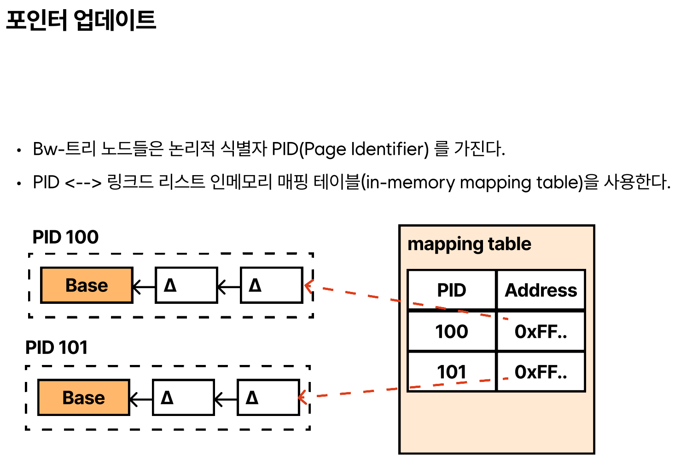

# Bw-Tree
지난 시간에 이어 B-Tree의 변종들을 보도록 하자. 이번엔 BuzzWord Tree인 `Bw-Tree`의 특징을 볼 것이다.

지금까지 우리가 본 B-Tree의 변종들은 근본적으로 **버퍼링 방식을 채택한 상태에서 최적화**하는 과정에서 발명된 것들이었지만, 여전히 버퍼링이 수반하는 **쓰기 증폭 및 공간 증폭**(HDD인 경우 **헤드 이동 시간**, SSD인 경우 **가비지 컬렉션**), 그리고 **동시성 문제**에 대해 만족스러운 해결책을 제시하지 않는다. 이 3가지 문제를 동시에 처리가능한 해결책을 강구하려면 아예 다른 방향의 접근이 필요하다.

이에 대해 Bw-Tree가 가진 주목할 만한 특징은
>- **log-structured storage**
>- **노드 체이닝**
>- **CAS를 통한 포인터 교체**

이 정도다. 이것만 보면 LAZY B-Tree와 차이가 뭔지 모르겠다고 할 수도 있다.

 Bw-Tree는 기본 노드와 수정 사항을 분리해서 기록한다. 기본 노드와 델타 노드가 이 방식의 구현체인데 델타 노드는 기본 노드에 줄줄이 변경사항이 연결된 링크드 리스트로 존재한다. 델타 노드는 **삽입,업데이트(삽입과 구별 불가),삭제 중 하나**를 나타낼 수 있다

 이는 LAZY B-Tree의 클린 페이지+업데이트 버퍼와 비슷한 방식이다. 대신 둘의 차이는 Bw-Tree는 노드와 업데이트 버퍼를 **가변**으로 본다는 점이다. 기본 노드에 추후 연산을 위한 공간을 Bw-Tree에서는 남겨놓을 필요가 없다. 어차피 수정 사항을 기본 노드와 분리되어 델타노드로 줄줄이 기록되기 때문이다.

 이것으로 쓰기 증폭, 공간 증폭이 해결된다. 대신 **나중에 필요한 시점에 통합(consolidation) 연산이 필요**하다. 통합 연산은 일정 델타 노드의 양이 채워졌을 시 행해지며, 분할 및 병합 연산 시 동시 접근을 막기 위해 부모 노드에 작업 중단용 델타 노드를 넣게 된다. 분할 또는 병합 연산 종료시 부모의 중단 델타 노드는 삭제 가능하다. 이는 나중에 병합 시 부모의 삭제될 형제에 대한 포인터 삭제 작업에도 도움을 준다.

 물론 이로 인해 단점도 존재하는데, 읽기 연산시에는 현존하는 모든 델타노드를 순회해야 현재 기본노드가 어떤 상태로 읽혀야 할지 알기 때문에 **읽기가 위주인 워크로드에는 최적인 구조는 아니다**. 대신 **작은 단위 쓰기 연산이 자주 일어나는 작업에 유리**하다.

 또 이렇게 링크드 리스트로 쓰려면 구현해야하는데 이를 디스크에 구현 시 디스크 조회가 폭증하므로 물리적으로 구현하지 않고 매핑시켜 구현한다.

 
 만약 업데이트한다면 루트에서 리프까지 트리를 탐색해 업데이트 대상인 논리적 리프 노드를 찾고,찾은 노드와 연결되는 새 델타 노드를 생성하여 매핑 테이블을 업데이트한다.

 그리고 Bw-Tree에선 래치가 없는데, 그럼 읽기 연산이 포인터 교체하는 시점에 이루어지면 결과가 이상해지지 않냐고 할 수 있는데, CAS 연산으로 업데이트하기 때문에 CPU단에서 원자적인 작업이므로 문제없다. 만약 두 스레드가 동일한 노드에 동시에 새 델타 노드를 붙이려고 한다면 하나는 실패,그 후 재시도 하게 된다.

 주목할만한 점은 더 이상 노드를 **물리적 엔티티가 아니라 논리적 엔티티로 보는 패러다임의 변화**를 만든 것이고, 이런 방식은 우리에게 `미리 공간할당` 혹은 `고정된 크기의 노드 설계`, 또는 `데이터 보관을 연속된 메모리 세그먼트`에 해야한다는 **부담을 없애준다**.

 Bw-Tree도 논리적으로는 B-Tree처럼 구성되어있기에 분할 및 병합같은 구조 수정 작업이 생기고, 대신 구현방식이 다르다.

아까 Bw Tree에는 래치가 없다고 했는데, 그렇다면 이 구조에서 가비지 컬렉션을 성공적으로 실행하기 위해선 읽기 프로그램이 활성된 페이지를 추적하는 다른 방법이 필요한데, 이는 병합되어 사라질 노드를 현재 메모리에서 다른 명령이 사용하는 경우 등에 대비해야하기 때문이다.

그래서 epoch 기반 회수 라는 기술을 사용하는데, 간단히 말하자면 시점별로 노드 상태를 추적하는 것이다. 만약 특정 epoch 중 일부 베이스 노드와 델타 노드가 매핑 테이블에서 사라진 경우, 원래 노드는 그 노드에 대해 직전과 현재 epoch에 존재하는 읽기 명령이 끝날때까지 보존된다. 이후 epoch에 존재하는 읽기 명령은 애초에 이 노드에 주소 지정 자체가 안됨이 보장된다.

# Cache-Oblivious B-Tree
이제 B-Tree 변종 중 마지막 형태다.

보통 B-Tree의 성능은 블록과 노드의 크기, 캐시라인 정렬 등 하드웨어적 특성에 영향을 받는다.

하지만 Cache oblivious라는 이름 답게 이 변종은 이런것을 몰라도, 메모리 계층 구조에 상관없이 최적에 근접한 성능을 낸다. 이는 서로 다른 머신 위에서도 DBMS의 스토리지 엔진 수정없이 빠르게 작동한다는 뜻이다.

모든 프로그램의 성능이 그렇듯 구동환경에 밀접하게 생각하고 최적화할 수록 그 결과가 여실히 드러나지만, 우리는 지금까지 b-tree를 캐시와 디스크 2계층 구조에서만 다뤘기에 현실에 적용할 경우 오버헤드가 많이 발생할 가능성이 있다.

하지만 그렇다고 하도 결국 순간에 데이터가 오고 가는 건 2계층 간에 이루어지기 때문에 cache oblivious b-tree 사용시 다단계 구조도 2단계 구조처럼 동작을 일반화시켜 성능을 향상시킬수 있다.

이 트리는 보통 van ended boas layout으로 보여지는데, 트리의 구조와 실제 메모리 배치를 보게되면 같은 서브트리 내 노드들이 인접하게 있음을 알 수 있다.

이렇게 되는 경우 한 노드 탐색 시 추후 있을 탐색에서 이미 그 노드에 인접한(서브트리 내에 있는) 데이터들이 전부 캐싱된 상태이므로 최적화에 도움이 된다.

이 변종의 가장 큰 특징 중 하나는 트리 구조가 불변이라는 것이다. 분할 및 합병이 일어나지 않는 대신, 정적 b-tree와 그 리프노드가 포인터로 가리키는 packed array로 구성된다. 리프노드의 값(포인터)은 바뀔수 있다.